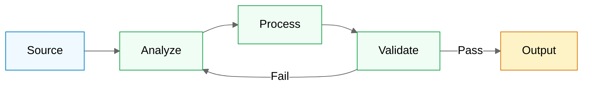

# Generate Architecture Diagrams

Generate comprehensive Mermaid diagrams for project documentation, visualizing workflow, data flows, and integration architecture.

## Parallel Agent Integration

This command uses parallel agents CONDITIONALLY when analyzing 5+ unique imports/modules.
When triggered, executes: `~/.claude/scripts/parallel_agent.sh --json --validate`

## Task

Create or update architecture diagram documentation with Mermaid diagrams that visualize the application architecture, data flows, and capabilities.

## Instructions

### Step 1: Analyze Current Codebase

Read key files to understand current architecture:
- Main entry points and orchestration files
- Client/service files for external integrations
- Provider/adapter pattern implementations
- Configuration files
- AGENTS.md or project context documentation

### Step 2: Generate Diagrams

Create documentation with these diagram types:

#### High Priority Diagrams

1. **Application Architecture** (Flowchart)
   - Complete end-to-end flow from input to output
   - Show major processing stages and decision points
   - Include parallel processing and validation gates

2. **Integration Flow** (Sequence)
   - Show interaction between main components and external services
   - Include request/response patterns and data transformations

3. **Component Architecture** (Class/Entity)
   - Show provider/adapter patterns
   - Common interfaces with configuration

4. **Deployment/Output Flow** (Sequence)
   - Data flow from processing to output destinations
   - Show validation, transformations, and deployment steps

#### Medium Priority Diagrams

5. **State Lifecycle** (State)
   - Lifecycle stages of primary entities
   - Include error states and rejections

6. **Decision Flow** (Flowchart)
   - Decision logic for key processing gates
   - Show validation rules and thresholds

7. **Data Model** (Flowchart)
   - Overview of data relationships
   - Show data sources feeding into processing

8. **Configuration Layer** (Flowchart)
   - Config loading from files, env vars, defaults
   - Show configuration hierarchy

### Step 3: Color Scheme (Traffic Light)

Use consistent color definitions:

```mermaid
%%{init: {'theme':'neutral'}}%%
flowchart LR
    classDef active fill:#22c55e,stroke:#166534,color:#fff
    classDef pending fill:#eab308,stroke:#a16207,color:#fff
    classDef error fill:#ef4444,stroke:#dc2626,color:#fff
    classDef external fill:#3b82f6,stroke:#1d4ed8,color:#fff
```

| Class | Color | Usage |
|-------|-------|-------|
| `active` | Green | Active/healthy components |
| `pending` | Yellow | In-progress states |
| `error` | Red | Error/failed states |
| `external` | Blue | External services |

### Step 4: Document Structure

```markdown
# Architecture Diagrams

> Visual documentation of application architecture and data flows

**Last Updated**: YYYY-MM-DD

---

## Table of Contents
[Links to all diagrams]

---

## Application Architecture
[Description]
[Mermaid diagram]
[Key components explained]

---

[Repeat for all diagrams]

---

## Related Documents
- [AGENTS.md](../AGENTS.md) - Project context
- [Related Doc](path/to/doc.md) - Brief description
```

### Step 5: Test Diagrams

After generating, verify each diagram:
1. Check Mermaid syntax is valid
2. Ensure all node names are properly quoted if they contain spaces
3. Verify subgraph labels use proper syntax
4. Test rendering in GitHub/GitLab markdown preview

## Mermaid Compatibility Notes

- **Never use `:::className` on subgraphs** - only nodes support class assignment. Use `NODE["label"]:::className` not `subgraph Name["label"]:::className`
- **Avoid emojis in quadrant labels** - causes syntax errors
- **Use `flowchart` instead of `block-beta`** - block diagrams not stable
- **Emojis work in**: node labels, pie labels, markdown text outside diagrams
- **Emojis break in**: quadrantChart labels, init config blocks

## Layout Guidelines

- **LR (Left-Right)**: Use for timelines, chains, progression flows
- **TB (Top-Bottom)**: Use for decision trees, hierarchies
- **Subgraphs**: Group by logical category
- **Max nodes**: Keep diagrams to ~20 nodes for readability

## Example Diagrams

### Basic Workflow



## Notes

- Use consistent color coding via Mermaid styles
- Ensure diagrams match actual code structure
- Keep diagrams focused - one concept per diagram
- Add brief explanations of key components below each diagram
- Reference parallel agent outputs when available for validation
