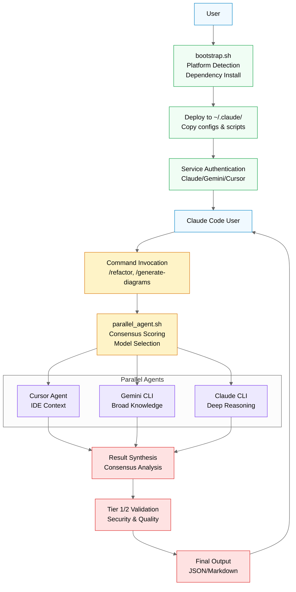
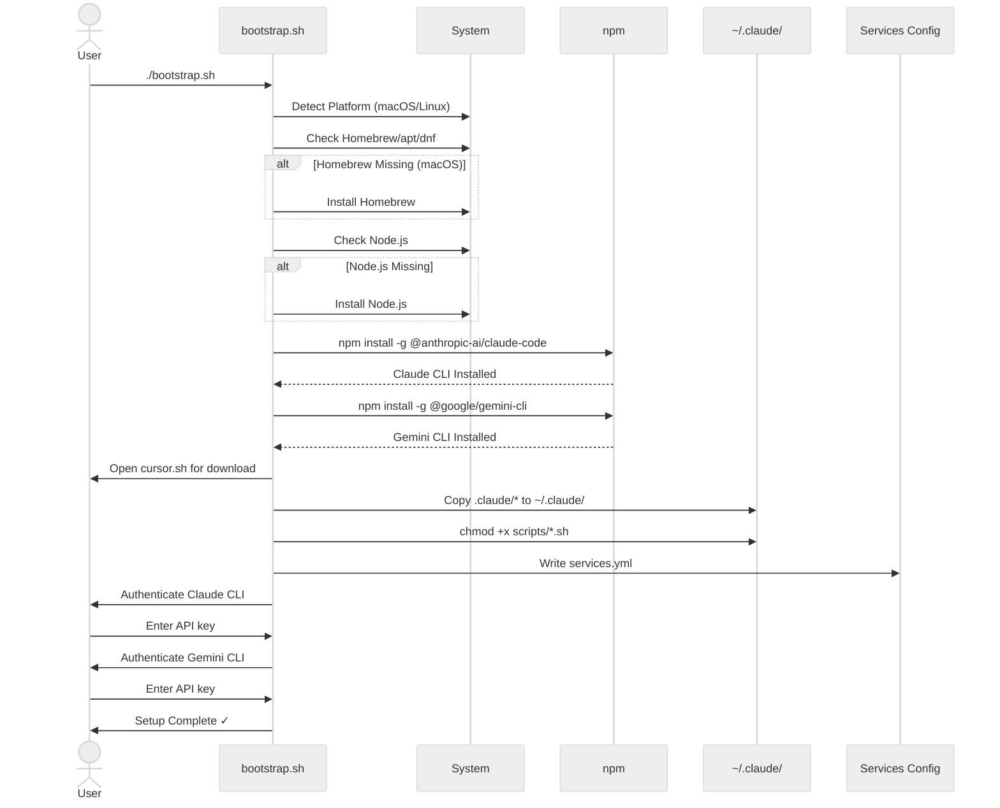
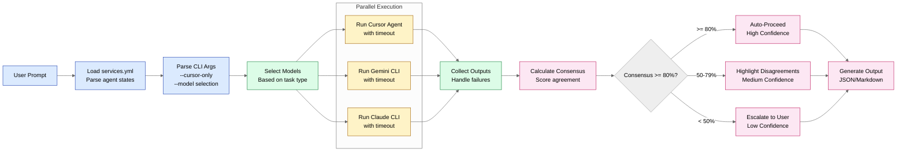
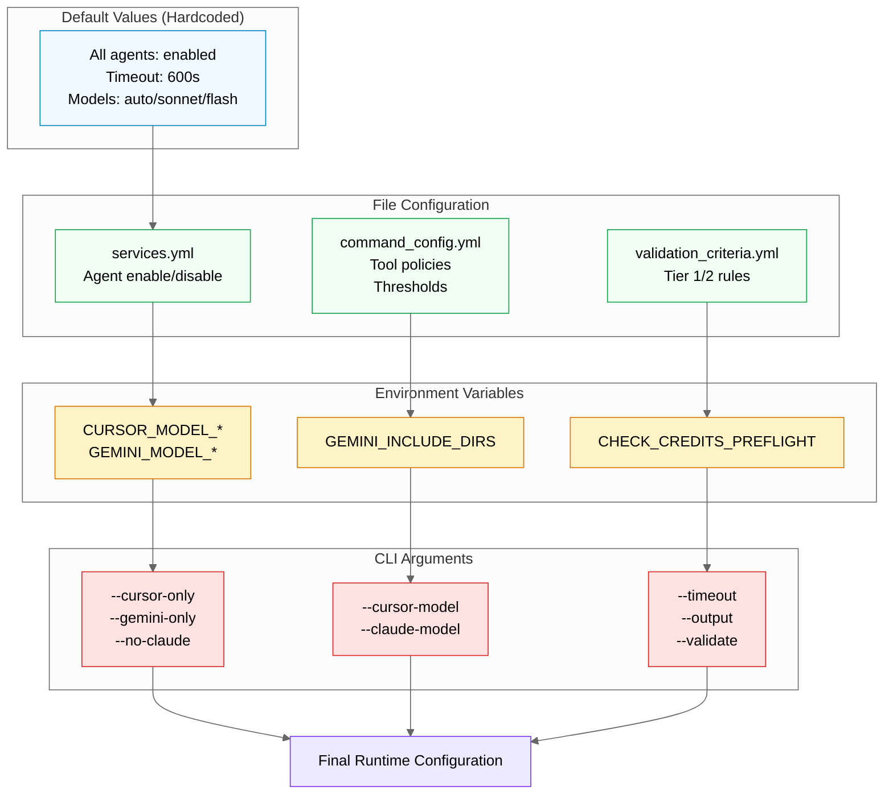
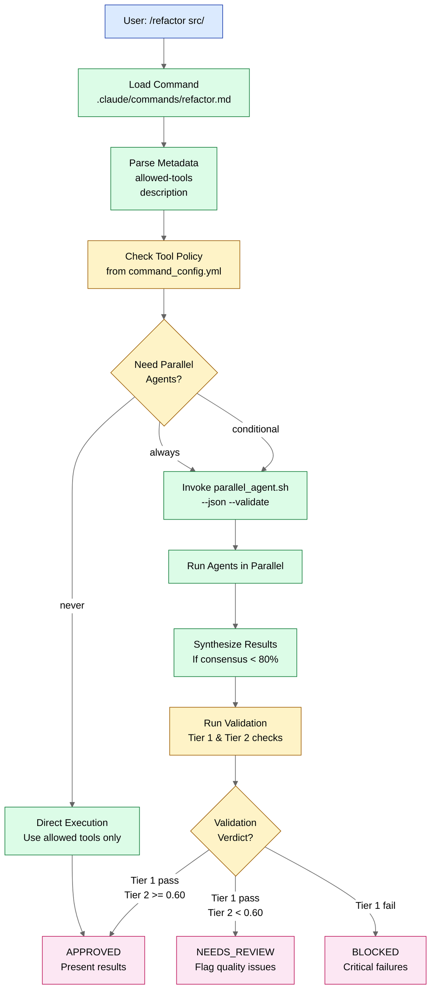
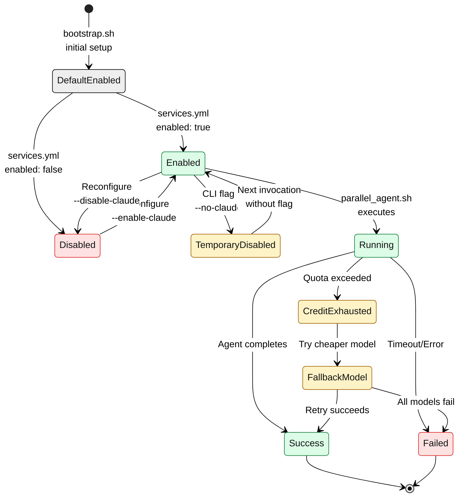
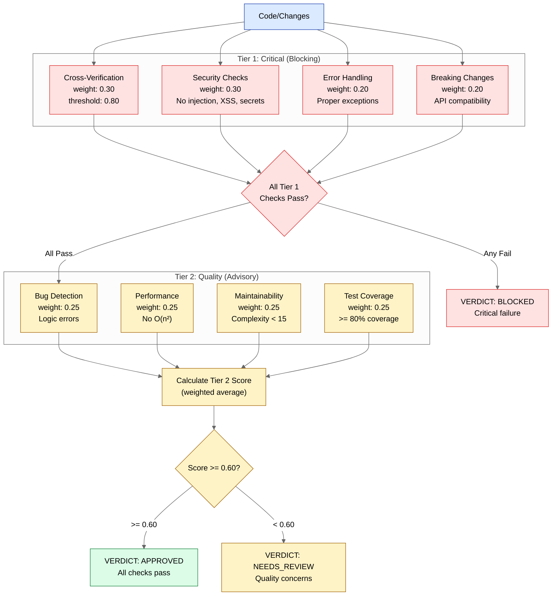

# Architecture Diagrams

> Visual documentation of the Manifest parallel LLM agent orchestration framework

**Last Updated**: 2026-01-27

---

## Table of Contents

1. [Application Architecture](#application-architecture)
2. [Bootstrap Flow](#bootstrap-flow)
3. [Parallel Agent Orchestration](#parallel-agent-orchestration)
4. [Configuration Hierarchy](#configuration-hierarchy)
5. [Command Processing Flow](#command-processing-flow)
6. [Service State Management](#service-state-management)
7. [Validation Pipeline](#validation-pipeline)

---

## Application Architecture

Complete end-to-end flow of the Manifest framework from user setup to parallel agent execution.

**Key Components:**

- **bootstrap.sh**: Cross-platform setup script (macOS/Linux) that handles dependency installation and authentication
- **parallel_agent.sh**: Core orchestration engine that runs multiple LLM agents in parallel
- **Commands**: User-facing slash commands (`/refactor`, `/generate-diagrams`, etc.)
- **Parallel Agents**: Three LLM services (Cursor, Gemini, Claude) providing diverse perspectives
- **Synthesis**: Consensus scoring and disagreement resolution
- **Validation**: Two-tier security and quality checks

---

## Bootstrap Flow

Detailed sequence of bootstrap.sh execution from initial run to authenticated services.

**Key Steps:**

1. **Platform Detection**: Identifies OS (macOS/Linux) and package manager
2. **Dependency Installation**: Homebrew, Node.js, and npm packages
3. **File Deployment**: Copies configuration to `~/.claude/`
4. **Service Configuration**: Writes `services.yml` with enabled/disabled states
5. **Authentication**: Guides user through API key setup for each service

---

## Parallel Agent Orchestration

Core orchestration flow showing how parallel_agent.sh coordinates multiple LLM agents.

**Consensus Thresholds:**

- **≥80%**: High confidence - proceed with unified recommendation
- **50-79%**: Medium confidence - highlight disagreements to user
- **<50%**: Low confidence - block and escalate for human review

**Model Selection by Task:**

| Task Type | Cursor | Claude | Gemini | Reason |
|-----------|--------|--------|--------|--------|
| Security | advanced | opus | pro | Maximum capability for critical code |
| Review | flash | sonnet | flash | Balanced performance/cost |
| Analyze | flash | sonnet | flash | Good reasoning without opus cost |
| Quick | mini | haiku | flash | Speed for simple queries |

---

## Configuration Hierarchy

Configuration loading and override precedence in the system.

**Override Priority (highest to lowest):**

1. **CLI Arguments**: Command-line flags (highest priority)
2. **Environment Variables**: Shell environment settings
3. **File Configuration**: YAML config files
4. **Hardcoded Defaults**: Built-in fallback values (lowest priority)

**Key Configuration Files:**

- `services.yml`: Controls which agents are enabled
- `command_config.yml`: Tool policies, thresholds, model defaults
- `validation_criteria.yml`: Security and quality validation rules

---

## Command Processing Flow

How user commands are processed from invocation to execution.

**Command Types:**

| Command | Parallel Agents | Validation Tier |
|---------|----------------|-----------------|
| `/refactor` | ALWAYS | Tier 1 (Security, Breaking Changes) |
| `/generate-diagrams` | CONDITIONAL (5+ modules) | Tier 2 (Quality) |
| `/improve-docs` | CONDITIONAL (>500 lines) | Tier 2 (Maintainability) |
| `/improve-readme` | NEVER | Tier 2 (Maintainability) |

---

## Service State Management

State transitions for enabled/disabled services throughout the lifecycle.

**State Transitions:**

1. **Bootstrap**: All services start enabled by default
2. **Configuration**: `services.yml` persists enabled/disabled state
3. **Runtime Override**: CLI flags (`--cursor-only`, `--no-claude`) temporarily modify state
4. **Execution**: Running state while agent processes request
5. **Credit Exhaustion**: Automatic fallback to cheaper models
6. **Reconfiguration**: User can change enabled state via `bootstrap.sh --reconfigure`

**Fallback Chains:**

- **Cursor**: gpt-5.2 → gpt-5.1-codex → gpt-5.1-codex-mini → auto
- **Claude**: opus → sonnet → haiku

---

## Validation Pipeline

Two-tier validation system for security-critical and quality checks.

**Tier 1 Checks (All Must Pass):**

| Check | Weight | Description |
|-------|--------|-------------|
| Cross-Verification | 0.30 | Multiple agents agree (≥80% consensus) |
| Security | 0.30 | No vulnerabilities (injection, XSS, secrets) |
| Error Handling | 0.20 | Proper exceptions, no silent failures |
| Breaking Changes | 0.20 | API compatibility maintained |

**Tier 2 Checks (Weighted Score ≥ 0.60):**

| Check | Weight | Description |
|-------|--------|-------------|
| Bug Detection | 0.25 | No logic errors, null refs, off-by-one |
| Performance | 0.25 | No O(n²), memory leaks, blocking I/O |
| Maintainability | 0.25 | Clear naming, complexity < 15 |
| Test Coverage | 0.25 | ≥80% coverage for changes |

**Verdicts:**

- **APPROVED**: Tier 1 passes, Tier 2 score ≥ 0.60
- **NEEDS_REVIEW**: Tier 1 passes, Tier 2 score < 0.60
- **BLOCKED**: Any Tier 1 check fails

---

## Related Documents

- [CLAUDE.md](../CLAUDE.md) - Repository overview and usage guide
- [.claude/CLAUDE.md](../.claude/CLAUDE.md) - Orchestration guide (deployed to ~/.claude/)
- [bootstrap.sh](../bootstrap.sh) - Bootstrap script source
- [parallel_agent.sh](../.claude/scripts/parallel_agent.sh) - Orchestration script source
- [command_config.yml](../.claude/config/command_config.yml) - Command configuration
- [validation_criteria.yml](../.claude/config/validation_criteria.yml) - Validation rules
